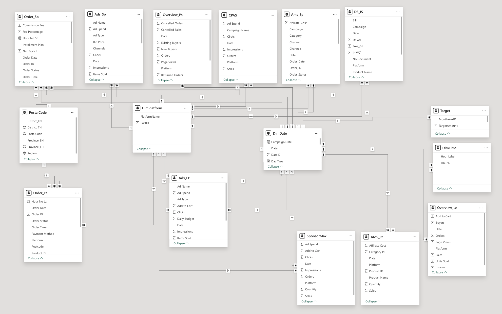

# 🛒 Allnii Marketplace — E-Commerce Performance Dashboard

A end-to-end data pipeline and Power BI dashboard for monitoring 
sales performance across Shopee and Lazada platforms.

---

## 📌 Overview

Built for a health supplement brand (Allnii) to consolidate 
multi-platform e-commerce data into a single real-time dashboard, 
replacing manual Excel reporting.

**Business Impact:**
- Reduced manual reporting time by ~80%
- Enabled daily monitoring of ROAS, Revenue, and Ad Spend
- Supported budget decisions across Shopee & Lazada campaigns

---

## 🗂️ Data Sources

| File | Description |
|---|---|
| [AMS_Lz.csv](csv/AMS_Lz.csv) | Lazada affiliate / attribution performance data |
| [AMS_Sp.csv](csv/AMS_Sp.csv) | Shopee affiliate / attribution performance data |
| [Ads_Sp.csv](csv/Ads_Sp.csv) | Shopee advertising campaign performance |
| [CPAS_Ps.csv](csv/CPAS_Ps.csv) | Facebook CPAS (Collaborative Performance Ads) data |
| [Order_Lz.csv](csv/Order_Lz.csv) | Lazada order transaction records |
| [Order_Sp.csv](csv/Order_Sp.csv) | Shopee order transaction records |
| [Overview_Ls.csv](csv/Overview_Ls.csv) | Lazada platform summary metrics |
| [Overview_Ps.csv](csv/Overview_Ps.csv) | Shopee platform summary metrics |
| [Sponsor_Lz.csv](csv/Sponsor_Lz.csv) | Lazada sponsored ads performance |

---

## ⚙️ Pipeline
```
Raw Export (Shopee/Lazada Seller Center)
        ↓
Power Query ETL
(clean, merge, normalize date/platform)
        ↓
Data Model (Star Schema in Power BI)
(DimDate, DimPlatform, DimTime, PostalCode)
        ↓
Power BI Dashboard (4 pages)
```

---

## 📊 Dashboard Pages

| Page | KPIs |
|---|---|
| Overview | Revenue, Spend, ROAS, CVR, AOV, Revenue by Product |
| Mid Month | H1 comparison, Daily Sales, Platform split |
| Health | Hourly order pattern, Weekend vs Weekday |
| Details | Geographic distribution, Order cancel analysis |

---

## 🧱 Data Model

Star schema with fact tables (Orders, Ads) connected 
to dimension tables (Date, Platform, Time, PostalCode)



---

## 🛠️ Tech Stack

- **ETL:** Power Query (M Language)
- **Data Model:** Power BI (Star Schema)
- **Visualization:** Power BI Desktop
- **Source:** Shopee & Lazada Seller Center exports

---

## 📸 Dashboard Preview

### Overview


### Mid Month


### Health


### Details


### Hourly Performance


### Weekend vs Weekday


### Data Model

