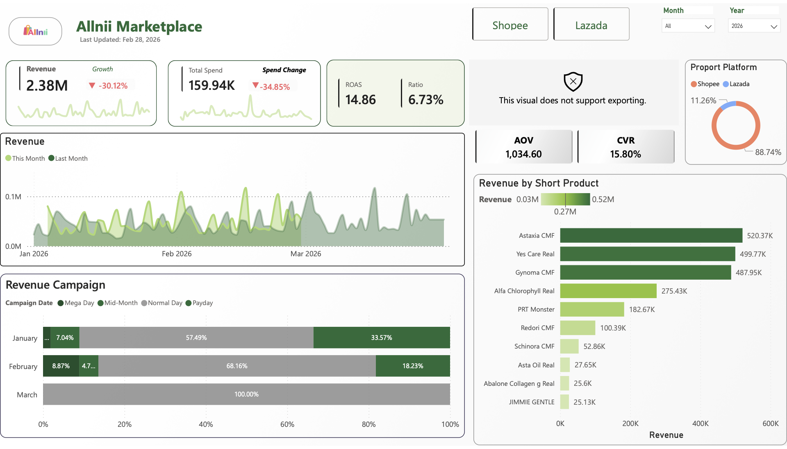
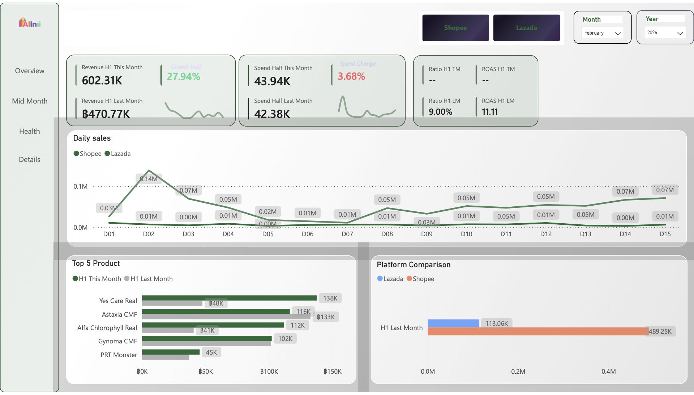
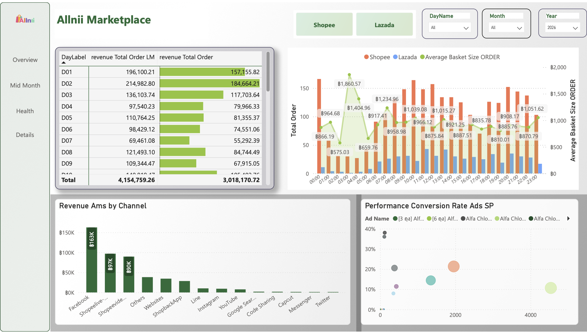
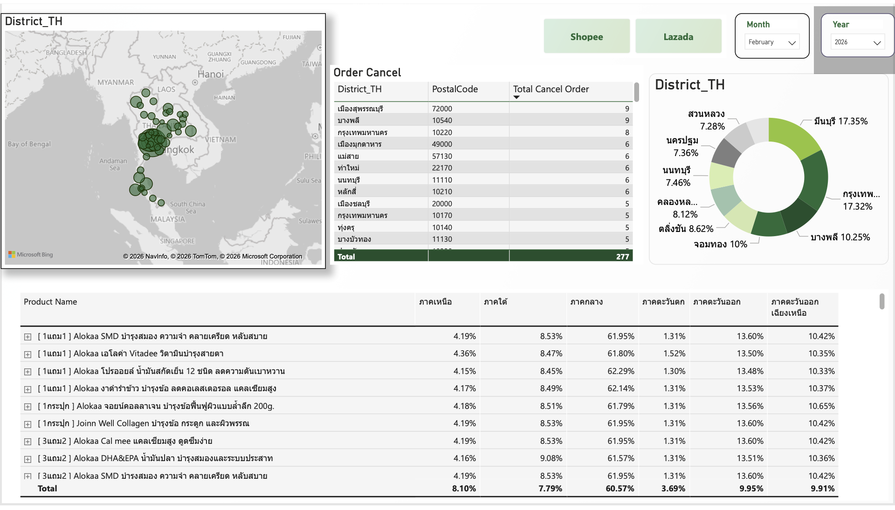
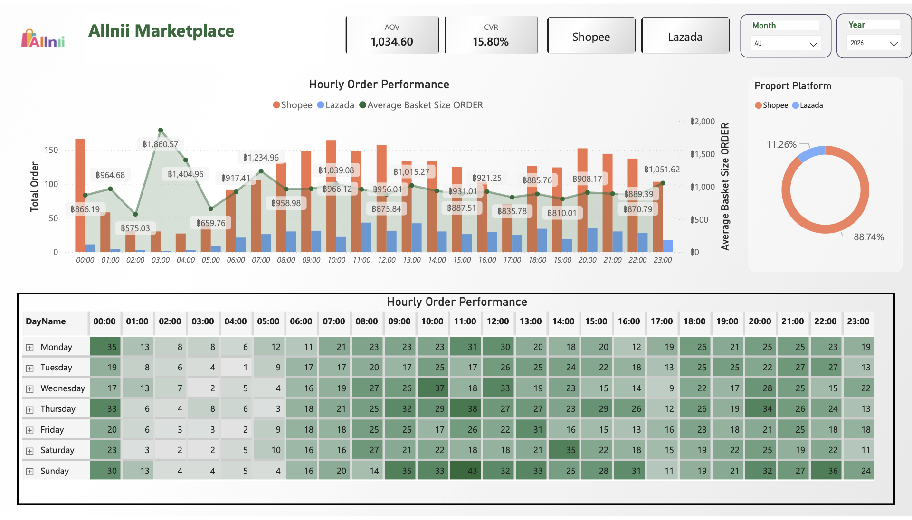
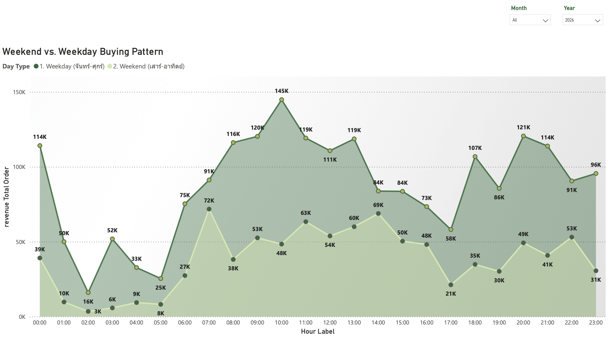
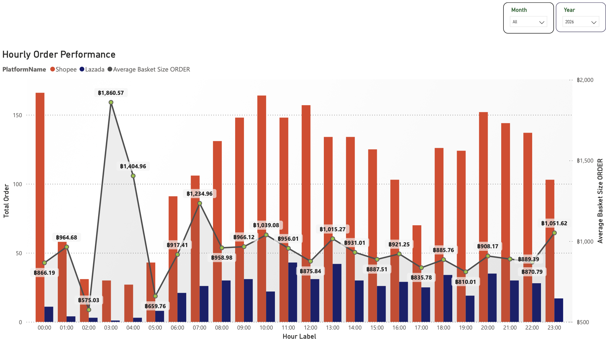

# 🛒 Allnii Marketplace — E-Commerce Performance Dashboard

A end-to-end data pipeline and Power BI dashboard for monitoring
sales performance across Shopee and Lazada platforms.

---

## 📌 Overview

Built for a health supplement brand (Allnii) to consolidate
multi-platform e-commerce data into a single real-time dashboard,
replacing manual Excel reporting.

**Business Impact:**

* Reduced manual reporting time by ~80%
* Enabled daily monitoring of ROAS, Revenue, and Ad Spend
* Supported budget decisions across Shopee & Lazada campaigns

---
## 📁 Project Structure
```
ecommerce-sales-pipeline/
├── power_query/        # M code for each data source
│   ├── pq_ads_sp.m
│   ├── pq_ads_lz.m
│   ├── pq_order_sp.m
│   ├── pq_order_lz.m
│   └── pq_cpas.m
├── csv/                # Sample source data
├── images/             # Dashboard screenshots
└── README.md
```
---

## 🗂️ Data Sources

| File | Description |
| --- | --- |
| `AMS_Lz.csv` | Lazada affiliate / attribution performance data |
| `AMS_Sp.csv` | Shopee affiliate / attribution performance data |
| `Ads_Sp.csv` | Shopee advertising campaign performance |
| `CPAS_Ps.csv` | Facebook CPAS (Collaborative Performance Ads) data |
| `Order_Lz.csv` | Lazada order transaction records |
| `Order_Sp.csv` | Shopee order transaction records |
| `Overview_Ls.csv` | Lazada platform summary metrics |
| `Overview_Ps.csv` | Shopee platform summary metrics |
| `Sponsor_Lz.csv` | Lazada sponsored ads performance |

---

## 📋 Schema Overview

### Order_Sp
| Column | Type | Description |
|--------|------|-------------|
| Order Date | date | วันที่สั่งซื้อ |
| Order ID | text | รหัส order |
| Order Status | text | สถานะ (Completed / Shipping / Cancelled) |
| Product ID | text | รหัสสินค้า / SKU |
| Product Name | text | ชื่อสินค้า |
| Variation | text | ตัวเลือกสินค้า |
| Quantity | int | จำนวนชิ้น |
| Sales | currency | ราคาขายสุทธิ (THB) |
| Net Payout | currency | ยอดที่ได้รับจริง (THB) |
| Commission Fee | currency | ค่าคอมมิชชั่น |
| Province | text | จังหวัดผู้รับ |
| Postcode | text | รหัสไปรษณีย์ |
| Payment Method | text | ช่องทางชำระเงิน |
| Payment Group | text | กลุ่มชำระเงิน (COD / Credit Card / E-Wallet) |
| Campaign Type Logic | text | ประเภทแคมเปญ (Mega Day / Payday / Normal) |
| Platform | text | "Shopee" |

### Order_Lz
| Column | Type | Description |
|--------|------|-------------|
| Order ID | int | รหัส order |
| Order Date | date | วันที่สั่งซื้อ |
| Order Status | text | สถานะ (Completed / Shipping / Cancelled) |
| Product ID | text | รหัสสินค้า / SKU |
| Product Name | text | ชื่อสินค้า |
| Variation | text | ตัวเลือกสินค้า |
| Sales | number | ราคาขาย (THB) |
| Postcode | text | รหัสไปรษณีย์ |
| Payment Method | text | ช่องทางชำระเงิน |
| Platform | text | "Lazada" |

### Ads_Sp
| Column | Type | Description |
|--------|------|-------------|
| Date | date | วันที่ |
| Ad Name | text | ชื่อโฆษณา |
| Ad Type | text | ประเภทโฆษณา |
| Impressions | int | จำนวนการแสดงผล |
| Clicks | int | จำนวนคลิก |
| Orders | int | จำนวน order จากโฆษณา |
| Sales | currency | ยอดขายจากโฆษณา (THB) |
| Ad Spend | currency | ค่าโฆษณา (THB) |
| Platform | text | "Shopee" |
| Campaign Type Logic | text | ประเภทแคมเปญ |

---

## ⚙️ Pipeline

```
Raw Export (Shopee/Lazada Seller Center)
        ↓
Power Query ETL
(clean, merge, normalize date/platform)
        ↓
Data Model (Star Schema in Power BI)
(DimDate, DimPlatform, DimTime, PostalCode)
        ↓
Power BI Dashboard (4 pages)
```

---

## 🔧 Power Query — ETL Logic (M Language)

### Extract Date from Non-Standard Header Row
Shopee exports embed the report date inside row 5 — not in a standard column.
This step parses it out before promoting headers.

```m
FinalDateValue =
    let
        RawText  = Source{5}[Column2],
        CleanText = Text.Start(
                        Text.Replace(
                            Text.Select(RawText, {"0".."9", "/", "-"}),
                            "-", "/"
                        ), 10),
        Parts = Text.Split(CleanText, "/")
    in
        #date(Number.From(Parts{2}), Number.From(Parts{1}), Number.From(Parts{0}))
```

### Normalize Thai Order Status → English
Shopee returns order statuses in Thai text.
This step translates and standardizes them to match Lazada for cross-platform analysis.

```m
#"Translated Status" = Table.TransformColumns(Source, {{
    "Order Status", each
        if Text.Contains(_, "ที่ต้องจัดส่ง") then "Pending Shipment"
        else if Text.Contains(_, "การจัดส่ง")  then "Shipping"
        else if Text.Contains(_, "สำเร็จ")      then "Completed"
        else if Text.Contains(_, "ยกเลิก")      then "Cancelled"
        else _, type text
}})
```

### Campaign Type Logic
Classify orders by campaign period based on order date — applied across all tables.

```m
#"Added Campaign Logic" = Table.AddColumn(Source, "Campaign Type Logic", each
    if [Order Date] = null then null else
    let
        D = Date.Day([Order Date]),
        M = Date.Month([Order Date])
    in
        if D = M  then "Mega Day"
        else if D = 15   then "Mid-Month"
        else if D >= 25  then "Payday"
        else "Normal Day"
, type text)
```

---

## 📐 DAX Measures

### AOV by Platform
Calculates Average Order Value per platform, with different revenue fields per source
(Lazada uses `completed` orders only; Shopee uses all `Net Payout`).

```dax
AOV by Platform =
VAR SelectedPlatform = SELECTEDVALUE('DimPlatform'[PlatformName])
VAR Sales_LZ  = CALCULATE(SUM('Order_Lz'[Sales]),          'Order_Lz'[Order Status] = "completed")
VAR Orders_LZ = CALCULATE(DISTINCTCOUNT('Order_Lz'[Order ID]), 'Order_Lz'[Order Status] = "completed")
VAR Sales_SP  = SUM('Order_Sp'[Net Payout])
VAR Orders_SP = DISTINCTCOUNT('Order_Sp'[Order ID])
RETURN
SWITCH(SelectedPlatform,
    "Shopee", DIVIDE(Sales_SP,  Orders_SP,  0),
    "Lazada", DIVIDE(Sales_LZ,  Orders_LZ,  0),
              DIVIDE(Sales_SP + Sales_LZ, Orders_SP + Orders_LZ, 0)
)
```

### % MoM Growth
Month-over-month revenue growth with ISBLANK guard to avoid divide-by-zero on first month.

```dax
% MoM Growth =
VAR CurrentSales   = [Revenue]
VAR LastMonthSales = [Revenue LM]
RETURN
IF(
    ISBLANK(LastMonthSales),
    BLANK(),
    DIVIDE(CurrentSales - LastMonthSales, LastMonthSales)
)
```

### Total Spend
Consolidates ad spend across all 6 channels into a single measure.

```dax
Total Spend =
    [Total Ad Lz]
    + [Total Ad Sp]
    + [Total AMS Lz]
    + [Total AMS Sp]
    + [Total CPAS]
    + [Total SponsorMax]
```

### CVR (Paid) by Platform
Conversion rate using paid clicks only (Ads + CPAS), split by platform.

```dax
CVR (Paid) by Platform =
VAR SelectedPlatform = SELECTEDVALUE('DimPlatform'[PlatformName])
VAR Orders_SP = DISTINCTCOUNT('Order_Sp'[Order ID])
VAR Orders_LZ = DISTINCTCOUNT('Order_Lz'[Order ID])
RETURN
SWITCH(SelectedPlatform,
    "Shopee", DIVIDE(Orders_SP, [Total SP Clicks], 0),
    "Lazada", DIVIDE(Orders_LZ, [Total LZ Clicks], 0),
              DIVIDE(Orders_SP + Orders_LZ, [Total SP Clicks] + [Total LZ Clicks], 0)
)
```

---

## 📊 Dashboard Pages

| Page | KPIs |
| --- | --- |
| Overview | Revenue, Spend, ROAS, CVR, AOV, Revenue by Product |
| Mid Month | H1 comparison, Daily Sales, Platform split |
| Health | Hourly order pattern, Weekend vs Weekday |
| Details | Geographic distribution, Order cancel analysis |

---

## 🧱 Data Model

Star schema with fact tables (Orders, Ads) connected
to dimension tables (Date, Platform, Time, PostalCode)


---

## 🛠️ Tech Stack

* **ETL:** Power Query (M Language)
* **Data Model:** Power BI (Star Schema)
* **Visualization:** Power BI Desktop
* **Source:** Shopee & Lazada Seller Center exports

---

## 📐 Key DAX Design Decisions
- MoM Growth uses same-day comparison for current month 
  to avoid misleading % from incomplete data
- Campaign Revenue uses proxy method (platform order % × ERP) 
  due to no shared key between campaign calendar and ERP
- Forecast uses Weighted Moving Average (recency bias) 
  instead of simple average

> Full DAX measures → [dax/measures.md](dax/measures.md)

---

## 📸 Dashboard Preview

### Overview


### Mid Month


### Health


### Details


### Hourly Performance


### Weekend vs Weekday


### Data Model

