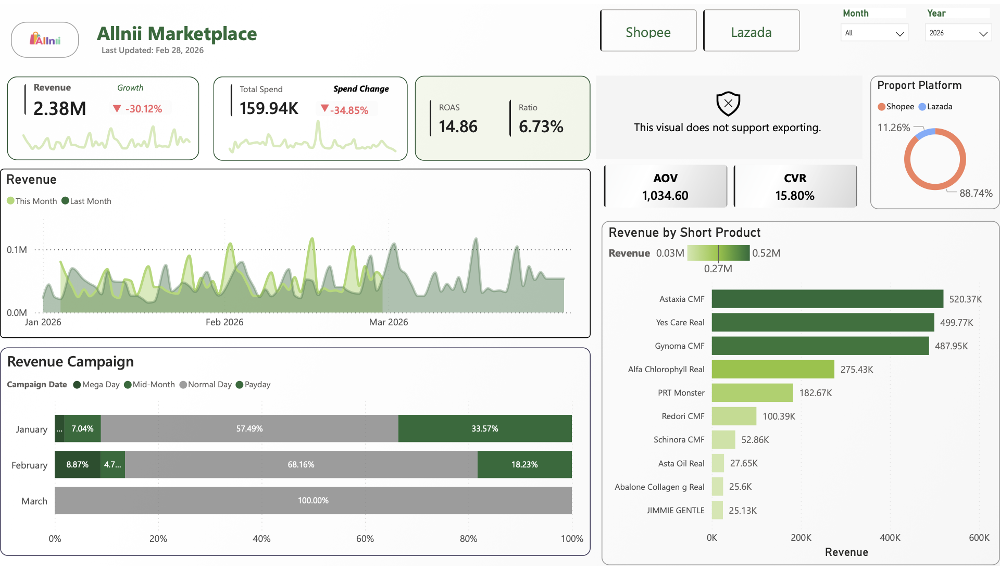
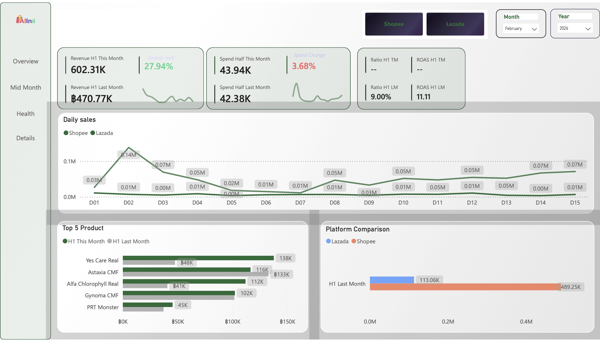
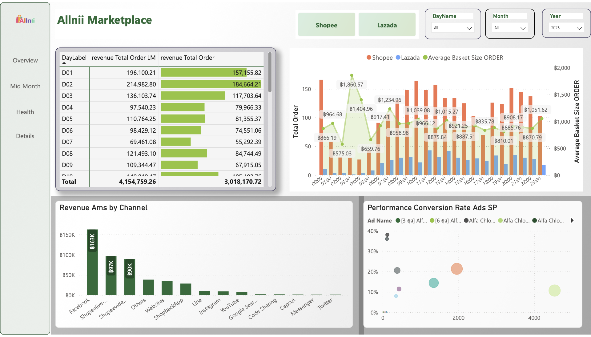
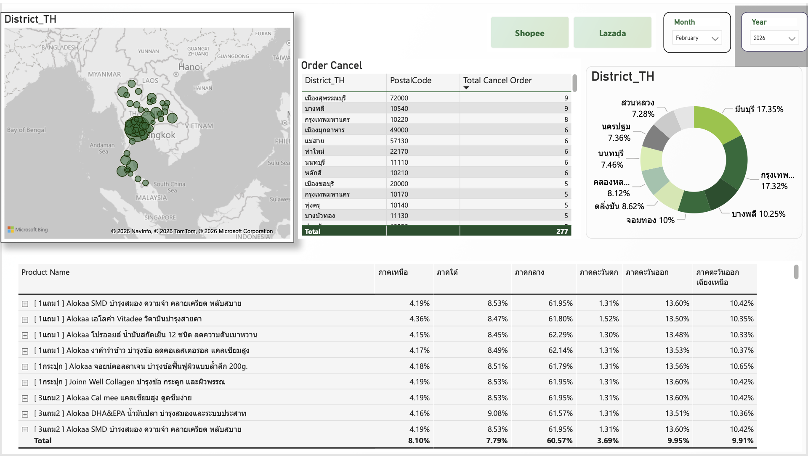
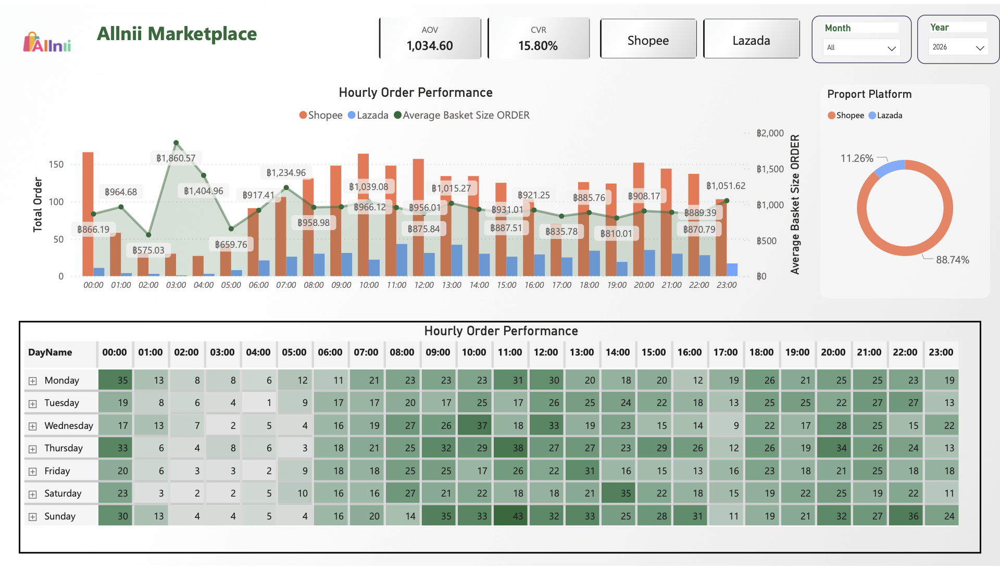
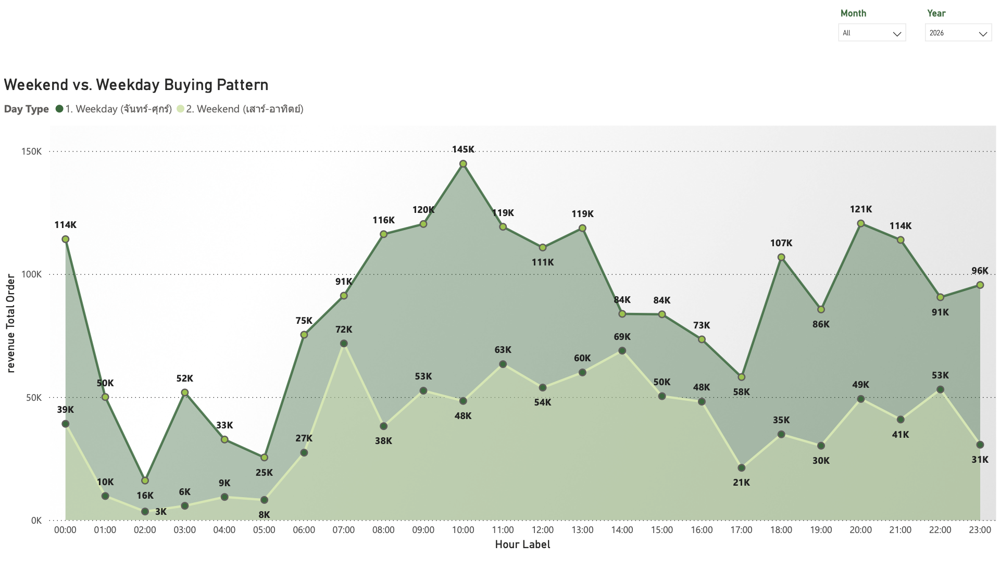
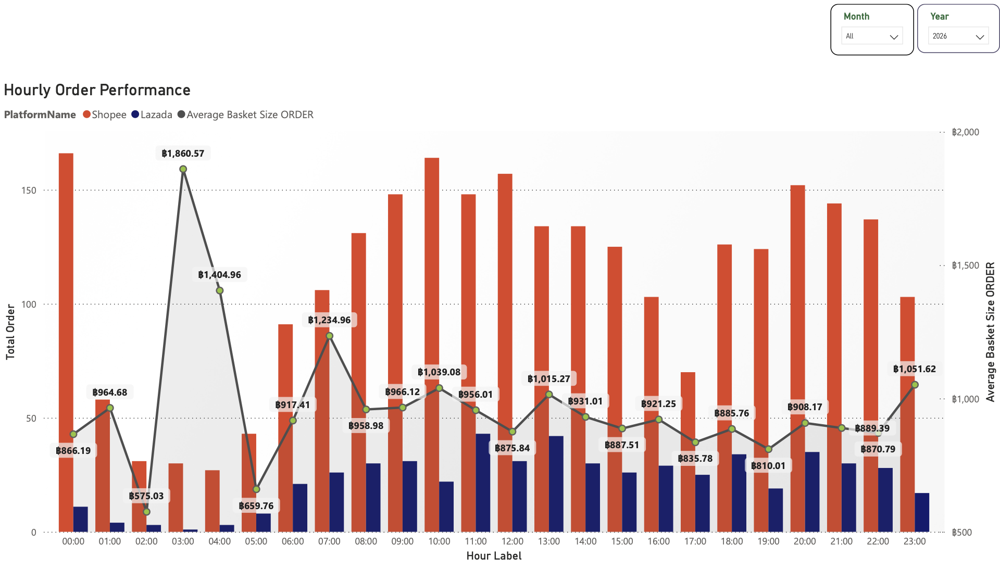
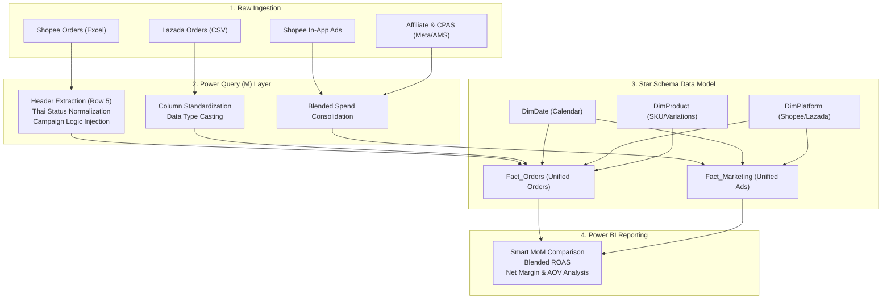

# Multi-Channel E-Commerce Analytics Pipeline

An end-to-end data pipeline, Power Query (M) transformation layer, and Power BI semantic model designed to consolidate disparate Seller Center exports (Shopee & Lazada) into a unified Star Schema dashboard.

---

##  &nbsp;Dashboard Previews

### 1. Executive Sales Overview


### 2. Mid-Month & Campaign Performance


### 3. Marketing Health & ROAS


### 4. SKU & Platform Details


### 5. Hourly Order Volume Heatmap


### 6. Weekend vs Weekday Trend Analysis


### 7. Power BI Tabular Data Model


---

##  &nbsp;The Problem & Business Context

Managing e-commerce sales across multiple platforms in Southeast Asia (Shopee and Lazada) typically involves dealing with incompatible export formats:

1. **Inconsistent Schema Formats:** Shopee exports order files with Thai status text and embedded report metadata in row 5, whereas Lazada exports standard English headers.
2. **Attribution & Fee Discrepancies:** Commission structures, platform vouchers, transaction fees, and shipping subsidies are recorded under different field names and calculation formulas.
3. **Misleading MoM Trends:** Comparing current Month-to-Date (MTD) performance against a completed prior month causes artificial negative growth alerts on executive scorecards.

This project implements an automated pipeline to clean, harmonize, and model multi-channel transactions and advertising metrics into an audited Power BI reporting model.

---

##  &nbsp;Architecture & Data Flow


```mermaid
flowchart TD
    subgraph Ingestion["1. Raw Ingestion"]
        SP_Orders["Shopee Orders (Excel)"]
        LZ_Orders["Lazada Orders (CSV)"]
        SP_Ads["Shopee In-App Ads"]
        Affiliates["Affiliate & CPAS (Meta/AMS)"]
    end

    subgraph Transformation["2. Power Query (M) Layer"]
        CleanSP["Header Extraction (Row 5)<br/>Thai Status Normalization<br/>Campaign Logic Injection"]
        CleanLZ["Column Standardization<br/>Data Type Casting"]
        MergeAds["Blended Spend Consolidation"]
    end

    subgraph Modeling["3. Star Schema Data Model"]
        DimDate["DimDate (Calendar)"]
        DimPlatform["DimPlatform (Shopee/Lazada)"]
        DimProduct["DimProduct (SKU/Variations)"]
        FactOrders["Fact_Orders (Unified Orders)"]
        FactAds["Fact_Marketing (Unified Ads)"]
    end

    subgraph Analytics["4. Power BI Reporting"]
        DAX_KPIs["Smart MoM Comparison<br/>Blended ROAS<br/>Net Margin & AOV Analysis"]
    end

    SP_Orders --> CleanSP
    LZ_Orders --> CleanLZ
    SP_Ads --> MergeAds
    Affiliates --> MergeAds

    CleanSP --> FactOrders
    CleanLZ --> FactOrders
    MergeAds --> FactAds

    DimDate --> FactOrders
    DimDate --> FactAds
    DimPlatform --> FactOrders
    DimPlatform --> FactAds
    DimProduct --> FactOrders

    FactOrders --> DAX_KPIs
    FactAds --> DAX_KPIs
```

---

##  &nbsp;Repository Structure

```
ecommerce-sales-pipeline/
├── power_query/            # Production Power Query (M) transformation scripts
│   ├── pq_order_sp.pq      # Shopee order cleaning, row 5 parsing & status translation
│   ├── pq_order_lz.pq      # Lazada order normalization & schema alignment
│   ├── pq_ads_sp.pq        # Shopee Ads performance ingestion
│   ├── pq_ads_lz.pq        # Lazada sponsored solutions ingestion
│   └── pq_cpas.pq          # Collaborative Performance Ads (CPAS) parsing
├── dax/
│   └── measures.md         # Documented DAX calculation library
├── images/                 # Dashboard visual previews
├── csv/                    # Synthetic sample dataset (anonymized schemas)
│   ├── Order_Sp.csv
│   ├── Order_Lz.csv
│   ├── Ads_Sp.csv
│   └── AMS_Sp.csv
└── README.md
```

---

##  &nbsp;Power Query (M) Highlights

### 1. Extracting Dates from Non-Standard Header Rows
Shopee exports embed report creation timestamps inside `Row 5` rather than standard tabular columns. The M function below parses this metadata dynamically before promoting headers:

```m
FinalDateValue =
    let
        RawText   = Source{5}[Column2],
        CleanText = Text.Start(
                        Text.Replace(
                            Text.Select(RawText, {"0".."9", "/", "-"}),
                            "-", "/"
                        ), 10),
        Parts     = Text.Split(CleanText, "/")
    in
        #date(Number.From(Parts{2}), Number.From(Parts{1}), Number.From(Parts{0}))
```

### 2. Normalizing Thai Order Statuses to English Standard
Standardizes localized fulfillment statuses across platforms (`Shopee Thai Text` → `Unified English Enum`):

```m
#"Translated Status" = Table.TransformColumns(Source, {{
    "Order Status", each
        if Text.Contains(_, "ที่ต้องจัดส่ง") then "Pending Shipment"
        else if Text.Contains(_, "การจัดส่ง")  then "Shipping"
        else if Text.Contains(_, "สำเร็จ")      then "Completed"
        else if Text.Contains(_, "ยกเลิก")      then "Cancelled"
        else _, type text
}})
```

### 3. Campaign Period Classification
Automatically tags transactions with Southeast Asian e-commerce campaign cadences (Double-Digit Mega Days, Mid-Month, Payday):

```m
#"Added Campaign Logic" = Table.AddColumn(Source, "Campaign Type Logic", each
    if [Order Date] = null then null else
    let
        D = Date.Day([Order Date]),
        M = Date.Month([Order Date])
    in
        if D = M        then "Mega Day"
        else if D = 15  then "Mid-Month"
        else if D >= 25 then "Payday"
        else "Normal Day"
, type text)
```

---

##  &nbsp;Core DAX Engineering

### Smart MoM Comparison (MTD Elapsed vs Full-Month Logic)
Eliminates artificial negative growth during ongoing months by comparing the exact elapsed days of the current month against the identical day window in the previous month:

```dax
% MoM Growth (Smart) =
VAR Today          = TODAY()
VAR SelectedMonth  = MONTH(MAX('DimDate'[Date]))
VAR SelectedYear   = YEAR(MAX('DimDate'[Date]))
VAR IsCurrentMonth = (SelectedMonth = MONTH(Today) && SelectedYear = YEAR(Today))
VAR DaysElapsed    = DAY(Today)

VAR CurrentSales      = [Gross Revenue]
VAR LastMonthFull     = CALCULATE([Gross Revenue], DATEADD('DimDate'[Date], -1, MONTH))
VAR LastMonthSameDays =
    CALCULATE(
        [Gross Revenue],
        DATESBETWEEN(
            'DimDate'[Date],
            DATE(YEAR(EOMONTH(Today, -1)), MONTH(EOMONTH(Today, -1)), 1),
            DATE(YEAR(EOMONTH(Today, -1)), MONTH(EOMONTH(Today, -1)), DaysElapsed)
        )
    )

RETURN
    IF(
        ISBLANK(CurrentSales), BLANK(),
        IF(
            IsCurrentMonth,
            DIVIDE(CurrentSales - LastMonthSameDays, LastMonthSameDays),
            DIVIDE(CurrentSales - LastMonthFull,     LastMonthFull)
        )
    )
```

### Cross-Platform Blended ROAS
Measures unified return on ad spend across Shopee In-App Ads, Lazada Sponsored Solutions, and Meta CPAS:

```dax
Blended ROAS = 
DIVIDE([Gross Revenue], [Total Ad Spend], 0)
```

---

##  &nbsp;Sample Data & Reproducibility

This repository includes a synthetic dataset in `csv/` generated with realistic product schemas, order flows, price points, and marketing spend distributions.

To test the Power Query transformations:
1. Open Power BI Desktop.
2. Load the sample CSVs from the `csv/` folder.
3. Apply the M code snippets from `power_query/` to see the automated cleaning and dimensional modeling in action.
